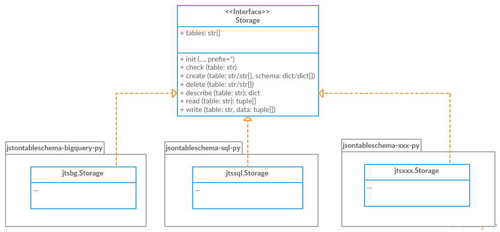

# tableschema-py

[](https://travis-ci.org/frictionlessdata/tableschema-py)
[](https://coveralls.io/r/frictionlessdata/tableschema-py?branch=master)
[](https://pypi.python.org/pypi/tableschema)
[](http://semver.org/)
[](https://gitter.im/frictionlessdata/chat)

A library for working with [Table Schema](http://specs.frictionlessdata.io/table-schema/) in Python.

## Features

- `Table` to work with data tables described by Table Schema
- `Schema` representing Table Schema
- `Field` representing Table Schema field
- `validate` to validate Table Schema
- `infer` to infer Table Schema from data
- built-in command-line interface to validate and infer schemas
- storage/plugins system to connect tables to different storage backends like SQL Database

## Important Notes

- There are BREAKING changes in `v1` (pre-release):
  - package on PyPi has been renamed to `tableschema`
  - following deprecated API has been removed the package:
    - `tableschema.push/pull_resource` (use `tableschema.Table`)
    - `tableschema.Validator` (use `tableschema.validate`)
    - `tableschema.storage` (use `tableschema.Storage`)
    - `tableschema.model` (use `tableschema.Schema`)
    - `tableschema.types` (use `tableschema.Field`)
  - rebased on Table Schema v1 null/types/constraints symantics
  - `Field.cast/test_value` now accepts `constraints=bool/list` argument instead of `skip_constraints=bool` and `constraint=str`
  - other changes could be introduced before final release
  - documentation for previous release (`v0.10`) could be found [here](https://github.com/frictionlessdata/tableschema-py/tree/v0.10.0)
- There are deprecating changes in `v0.7`:
  - renewed API has been introduced in non breaking manner
  - documentation for deprecated API could be found [here](https://github.com/frictionlessdata/tableschema-py/tree/0.6.5)

## Gettings Started

### Installation

```bash
$ pip install jsontableschema # v0.10
$ pip install tableschema --pre # v1.0-alpha
```
### Example

```python
from tableschema import Table

# Create table
table = Table('path.csv', schema='schema.json')

# Print schema descriptor
print(table.schema.descriptor)

# Print cast rows in a dict form
for keyed_row in table.iter(keyed=True):
    print(keyed_row)
```

### Table

Table represents data described by Table Schema:

```python
# pip install sqlalchemy tableschema-sql
import sqlalchemy as sa
from pprint import pprint
from tableschema import Table

# Data source
SOURCE = 'https://raw.githubusercontent.com/frictionlessdata/tableschema-py/master/data/data_infer.csv'

# Create SQL database
db = sa.create_engine('sqlite://')

# Data processor
def skip_under_30(erows):
    for number, headers, row in erows:
        krow = dict(zip(headers, row))
        if krow['age'] >= 30:
            yield (number, headers, row)

# Work with table
table = Table(SOURCE, post_cast=[skip_under_30])
table.schema.save('tmp/persons.json') # Save INFERRED schema
table.save('persons', backend='sql', engine=db) # Save data to SQL
table.save('tmp/persons.csv')  # Save data to DRIVE

# Check the result
pprint(Table('persons', backend='sql', engine=db).read(keyed=True))
pprint(Table('tmp/persons.csv').read(keyed=True))
# Will print (twice)
# [{'age': 39, 'id': 1, 'name': 'Paul'},
#  {'age': 36, 'id': 3, 'name': 'Jane'}]
```

### Schema

A model of a schema with helpful methods for working with the schema and supported data. Schema instances can be initialized with a schema source as a filepath or url to a JSON file, or a Python dict. The schema is initially validated (see [validate](#validate) below), and will raise an exception if not a valid Table Schema.

```python
from tableschema import Schema

# Init schema
schema = Schema('path.json')

# Cast a row
schema.cast_row(['12345', 'a string', 'another field'])
```

Methods available to `Schema` instances:

- `descriptor` - return schema descriptor
- `fields` - an array of the schema's Field instances
- `headers` - an array of the schema headers
- `primary_key` - the primary key field for the schema as an array
- `foreignKey` - the foreign key property for the schema as an array
- `get_field(name)` - return the field object for given name
- `has_field(name)` - return a bool if the field exists in the schema
- `cast_row(row, no_fail_fast=False)` - return row cast against schema
- `save(target)` - save schema to filesystem

Where the option `no_fail_fast` is given, it will collect all errors it encouters and an exceptions.MultipleInvalid will be raised (if there are errors).

### Field

```python
from tableschema import Field

# Init field
field = Field({'name': 'name', type': 'number'})

# Cast a value
field.cast_value('12345') # -> 12345
```

Data values can be cast to native Python objects with a Field instance. Type instances can be initialized with [field descriptors](https://specs.frictionlessdata.io/table-schema/). This allows formats and constraints to be defined.

Casting a value will check the value is of the expected type, is in the correct format, and complies with any constraints imposed by a schema. E.g. a date value (in ISO 8601 format) can be cast with a DateType instance. Values that can't be cast will raise an `InvalidCastError` exception.

Casting a value that doesn't meet the constraints will raise a `ConstraintError` exception.

### validate

Given a schema as JSON file, url to JSON file, or a Python dict, `validate` returns `True` for a valid Table Schema, or raises an exception, `SchemaValidationError`. It validates only **schema**, not data against schema!

```python
import io
import json

from tableschema import validate

with io.open('schema_to_validate.json') as stream:
    descriptor = json.load(stream)

try:
    tableschema.validate(descriptor)
except tableschema.exceptions.SchemaValidationError as exception:
   # handle error

```

It may be useful to report multiple errors when validating a schema. This can be done with `no_fail_fast` flag set to True.

```python
try:
    tableschema.validate(descriptor, no_fail_fast=True)
except tableschema.exceptions.MultipleInvalid as exception:
    for error in exception.errors:
        # handle error
```

### infer

Given headers and data, `infer` will return a Table Schema as a Python dict based on the data values. Given the data file, data_to_infer.csv:

```
id,age,name
1,39,Paul
2,23,Jimmy
3,36,Jane
4,28,Judy
```

Call `infer` with headers and values from the datafile:

```python
import io
import csv

from tableschema import infer

filepath = 'data_to_infer.csv'
with io.open(filepath) as stream:
    headers = stream.readline().rstrip('\n').split(',')
    values = csv.reader(stream)

schema = infer(headers, values)
```

`schema` is now a schema dict:

```python
{u'fields': [
    {
        u'description': u'',
        u'format': u'default',
        u'name': u'id',
        u'title': u'',
        u'type': u'integer'
    },
    {
        u'description': u'',
        u'format': u'default',
        u'name': u'age',
        u'title': u'',
        u'type': u'integer'
    },
    {
        u'description': u'',
        u'format': u'default',
        u'name': u'name',
        u'title': u'',
        u'type': u'string'
    }]
}
```

The number of rows used by `infer` can be limited with the `row_limit` argument.

### CLI

> It's a provisional API excluded from SemVer. If you use it as a part of other program please pin concrete `goodtables` version to your requirements file.

Table Schema features a CLI called `tableschema`. This CLI exposes the `infer` and `validate` functions for command line use.

Example of `validate` usage:

```
$ tableschema validate path/to-schema.json
```

Example of `infer` usage:

```
$ tableschema infer path/to/data.csv
```

The response is a schema as JSON. The optional argument `--encoding` allows a character encoding to be specified for the data file. The default is utf-8.

### Storage

The library includes interface declaration to implement tabular `Storage`:



An implementor should follow `tableschema.Storage` interface to write his
own storage backend. This backend could be used with `Table` class. See `plugins`
system below to know how to integrate custom storage plugin.

### plugins

Table Schema has a plugin system.  Any package with the name like `tableschema_<name>` could be imported as:

```python
from tableschema.plugins import <name>
```

If a plugin is not installed `ImportError` will be raised with a message describing how to install the plugin.

A list of officially supported plugins:
- BigQuery Storage - https://github.com/frictionlessdata/tableschema-bigquery-py
- Pandas Storage - https://github.com/frictionlessdata/tableschema-pandas-py
- SQL Storage - https://github.com/frictionlessdata/tableschema-sql-py

## API Reference

### Snapshot

```
Table(source, schema=None, post_cast=None, backend=None, **options)
    stream -> tabulator.Stream
    schema -> Schema
    name -> str
    iter(keyed/extended=False) -> (generator) (keyed/extended)row[]
    read(keyed/extended=False, limit=None) -> (keyed/extended)row[]
    save(target, backend=None, **options)
Schema(descriptor)
    descriptor -> dict
    fields -> Field[]
    headers -> str[]
    primary_key -> str[]
    foreign_keys -> str[]
    get_field(name) -> Field
    has_field(name) -> bool
    cast_row(row, no_fail_fast=False) -> row
    save(target)
Field(descriptor)
    descriptor -> dict
    name -> str
    type -> str
    format -> str
    constraints -> dict
    cast_value(value, constraints=True) -> value
    test_value(value, constraints=True) -> bool
validate(descriptor, no_fail_fast=False) -> bool
infer(headers, values) -> descriptor
exceptions
~cli
---
Storage(**options)
    buckets -> str[]
    create(bucket, descriptor, force=False)
    delete(bucket=None, ignore=False)
    describe(bucket, descriptor=None) -> descriptor
    iter(bucket) -> (generator) row[]
    read(bucket) -> row[]
    write(bucket, rows)
plugins
```

### Detailed

- [Docstrings](https://github.com/frictionlessdata/tableschema-py/tree/master/tableschema)
- [Changelog](https://github.com/frictionlessdata/tableschema-py/commits/master)

## Contributing

Please read the contribution guideline:

[How to Contribute](CONTRIBUTING.md)

Thanks!
